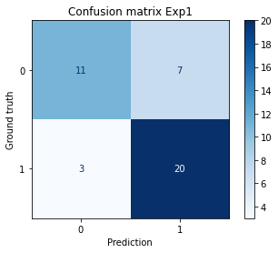
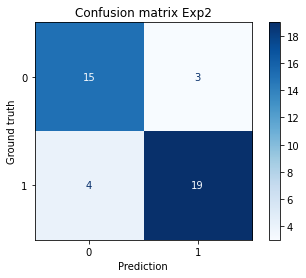
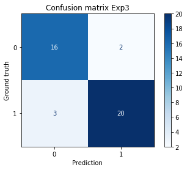

# Report

1. Program architecture

2. Experiment for model training
    1. Using [data_processing.ipnb](notebooks/data_processing.ipynb) to generate training/testing data. The generated data will be stored in [data/csv_data](data/csv_data) folder. There will be 3 files, including train.csv, train_upsample.csv, and test.csv. The train.csv contains the training data without upsampling data, while the train_upsample.csv contains data after upsamping for data balance.
    2. Start server <code>python src/app.py</code>
    3. Upload data into server. Please refer to [this section](README.md#upload-data-into-server) to upload the data. You have to upload each file seperately. After uploading each file, please note the id of created file. If you forget the created file id, you can check it with [this API](README.md#check-list-of-uploaded-data)
    4. Run experiment 1. Experiement 1 will train the default model with no upsampling data. Please edit [config/train1.yaml](config/train1.yaml) with your uploaded train.csv id and test.csv id. For example, if train.csv has id is '0dfee6be-117e-4968-bb1e-8544bec9fb34' and test.csv has id is '2bc7a436-10db-4b57-acce-07b3ea6a1c6b', then please modify the config as below:
        ```
        model:
            name: RandomForestClassifier
        data:
            features: {'Pclass':'num', 'Sex':'cat', 'Age':'num', 'Fare':'num'}
            target: {'Survived':'cat'}
            train_id_list: ['0dfee6be-117e-4968-bb1e-8544bec9fb34']
            test_id_list: ['2bc7a436-10db-4b57-acce-07b3ea6a1c6b']
        ```
        Please refer to [this section](README.md#train-a-model) to train the model.
    5. Run experiment 2. Experiement 2 will train the model with upsampling data. Please edit [config/train2.yaml](config/train2.yaml) with your uploaded train_upsample.csv id and test.csv id. For example, if train_upsample.csv has id is 'f7e2b256-4883-4c93-8085-01a33f47f0c7', then please modify the config as below:
        ```
        model:
            name: RandomForestClassifier
        data:
            features: {'Pclass':'num', 'Sex':'cat', 'Age':'num', 'Fare':'num'}
            target: {'Survived':'cat'}
            train_id_list: ['f7e2b256-4883-4c93-8085-01a33f47f0c7']
            test_id_list: ['2bc7a436-10db-4b57-acce-07b3ea6a1c6b']
        ```
        Note that you should use the same test id as experiment 1
    6. Run experiment 3. Experiement 3 will train the model with upsampling data and better model hyper parameter. Please edit [config/train3.yaml](config/train3.yaml) with your uploaded train_upsample.csv id and test.csv id that same as experiment 2. The config for model hyper parameter has already included.
    7. To update the current model of the server, please refer to [this section](README.md#assign-a-model). You may need to note the model id for this assigment, if you forget it, you can check the model id by [this API](README.md#check-all-trained-model)
    
    ***Note that if you don't want to train the experiments with the API, you can use the code in [data_processing.ipnb](notebooks/data_processing.ipynb) for the training.***

3. The inference result can be received through [this API](README.md#predict-the-survivors-of-the-titanic). You need to send a csv of data feture into the server (the requirement column for the model must be existed). The result is simple an array of prediction in the same order as the sent csv. To test the model, you can use [this API](README.md#run-test-models) to get the result of all model. The result includes both accuracy_score and f1_score and the prediction of each model as well as ground truth data for plotting confusion matrix. 

4. For comparing the model, the f1_score, accuracy_score and the confusion matrix are displayed. We can compare the model based on the accuracy_score and f1_score (the higher the better model), and the confusion matrix will show how the model performance on each class. 

5. You can check the result of 3 experiments in the [data_processing.ipnb](notebooks/data_processing.ipynb). The experiment1 has f1_score is 0.8. As it is the baseline, and no data augmentation, the model tends to predict the higher amount class. Below is the confusion matrix.

    

    In the experiment2, the same model was used, and the data augmentation was employed. This time the prediction became more balance while 4 wrong samples of survied=0 became correct with the cost that 1 true sample of survied=1 became wrong. However as the data of survied=0 is less than survied=1, the percent of correctness was increased. The f1_score was increased to 0.84. Below is the confusion matrix. 

    

    In the experiment3, the same model with better hyper parameter was used, the same data augmentation was employed and the feature selection was applied too. As the above modification, the final model was significantly out perform the 2 above model while the precision and recall of both 2 classes were high. The f1_score now increased to 0.89

    

6. To reproduce the experiment, you can retrain a model with a same config as before, then if you want to select it as the inference model, assign its id with the [API](README.md#assign-a-model)

7. Currently, there is no automatically model updating, the model will be updated manually after training the model and testing. In the future, the server should implement the automatically model updating function as below:
    1. After training a model, if there is no other pretrained model, assign it as the inference model
    2. If there are any other trained model, run the test will all test data on the current inference model and the newly trained model. If the f1_score of the new trained model is higher, assign it as the inference model.